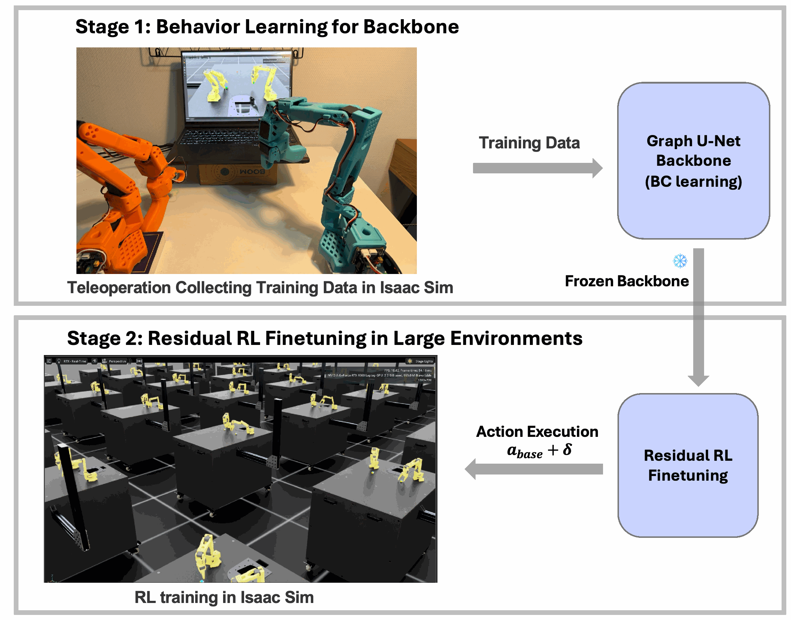
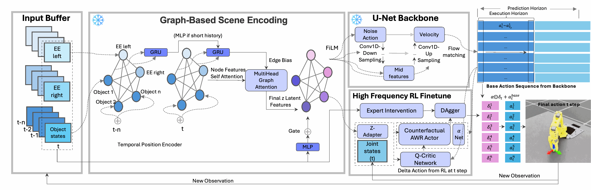
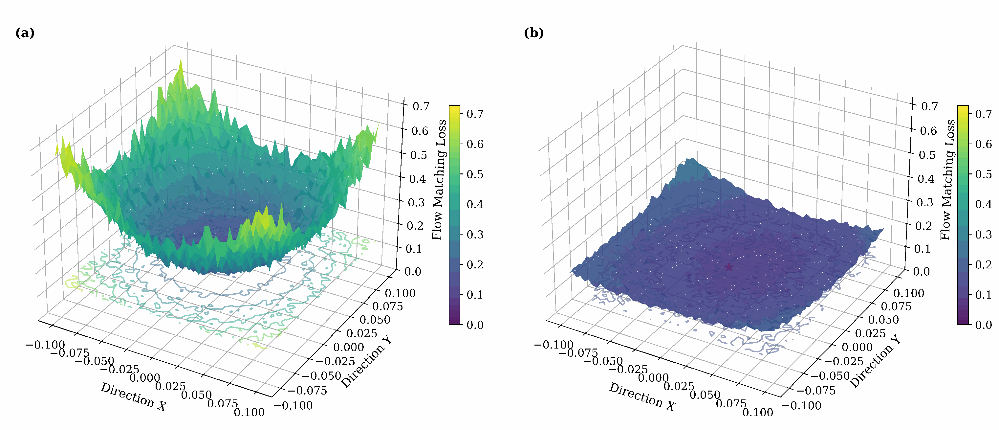
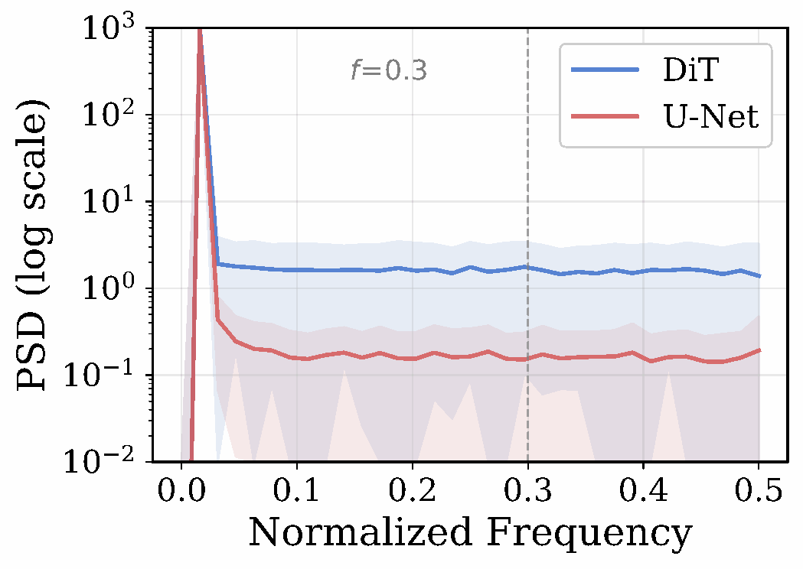
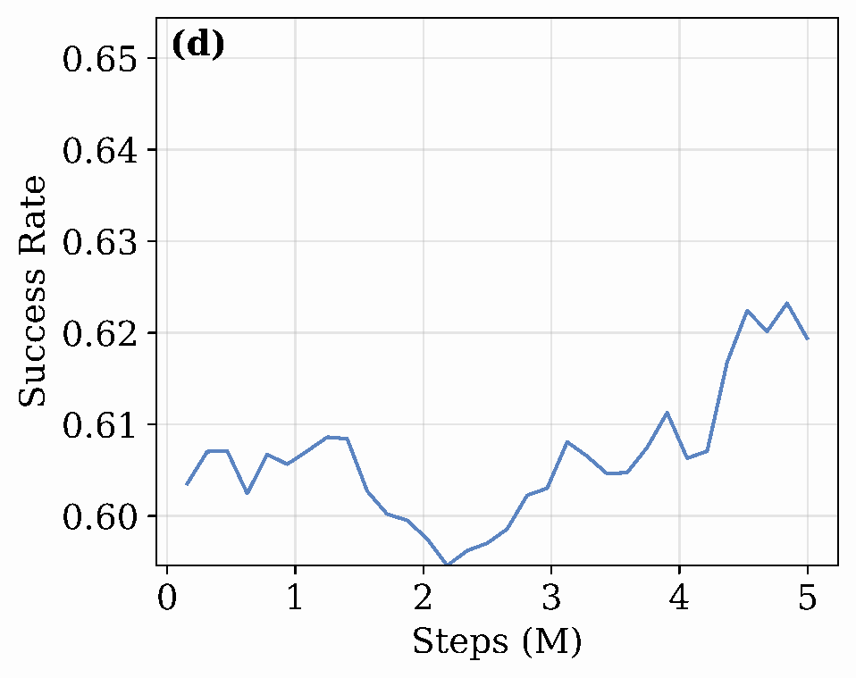

# Graph-Based Diffusion Policy with Residual RL for Dual-Arm Manipulation

<p align="center">
  
</p>

<p align="center">
  <b>Stage 1</b>: Behavior cloning from teleoperation &rarr; <b>Stage 2</b>: Residual RL fine-tuning in 512 parallel environments
</p>

<p align="center">
  <a href="#method">Method</a> &bull;
  <a href="#results">Results</a> &bull;
  <a href="#demo-videos">Demo</a> &bull;
  <a href="#quick-start">Quick Start</a> &bull;
  <a href="#citation">Citation</a>
</p>

---

We propose a **Graph-Conditioned Dual-Frequency Framework** that explicitly decouples **low-frequency trajectory planning** from **high-frequency reactive correction** for dual-arm robotic manipulation. A spatio-temporal graph encoder preserves the 3D geometric topology of the workspace, conditioning a 1D convolutional U-Net that acts as an intrinsic low-pass filter for smooth, hardware-safe trajectory generation. A residual RL agent with Counterfactual AWR then provides bounded, step-wise corrections for millimeter-precision placement — without destroying the pre-trained kinematic prior.

> MSc Thesis — Eindhoven University of Technology, Department of Electrical Engineering
> In collaboration with Unseq B.V.

## Method

### Detailed Architecture

<p align="center">
  
</p>

<p align="center">
  <em>The Graph-conditioned Diffusion backbone generates long-horizon base trajectories (a<sub>base</sub>), while the high-frequency Residual RL agent predicts step-wise adjustments (&omega;<sub>t</sub>) for precise closed-loop control. The DAgger-style expert accelerates exploration during training only — the policy operates fully autonomously at inference.</em>
</p>

The framework consists of four tightly integrated components:

**1. Spatio-Temporal Graph Encoder**
- Nodes represent physical entities (end-effectors, objects) with 7D pose (position + quaternion)
- Edges encode pairwise spatial relationships: translational proximity + rotational alignment
- Edge-conditioned FiLM modulation injects geometric bias into graph attention
- Learnable graph gate (converges to 0.4-0.7) balances geometric vs. raw-pose pathways

**2. Graph-Conditioned 1D U-Net Backbone**
- FiLM-conditioned U-Net generates full trajectory chunks via Flow Matching (K=15 steps)
- Acts as an intrinsic low-pass filter — produces smoother trajectories than Diffusion Transformers
- Receding Horizon Control: execute T<sub>p</sub>/2 steps, then re-plan from fresh observations

**3. Residual RL Agent (Counterfactual AWR)**
- Near-identity Z-Adapter prevents catastrophic forgetting of pre-trained features
- Counterfactual advantage: computed against Q(s, a<sub>base</sub>) instead of V(s), isolating the residual's contribution
- Hard L<sub>2</sub> clamp (ω<sub>max</sub> = 0.25) confines corrections to a safe operational envelope
- Separate binary gripper head (excluded from continuous residual)
- Expectile critic (τ = 0.7) with adaptive ESR temperature

**4. Expert-Guided Intervention (Training Only)**
- Jacobian-based IK expert provides DAgger-style corrective anchors at zero cost
- Two-phase stacking funnel: align XY at hover height → descend once Δp<sub>xy</sub> < 3mm
- Gripper expert triggers release when stacking geometry is satisfied
- Expert ratio decays 1.0 → 0.0 (ρ = 0.95) ensuring final autonomous convergence

## Results

### Why U-Net over DiT?

<table>
<tr>
<td width="50%" align="center">

<br>
<em>(a) DiT: rugged topology with sharp local minima &nbsp;&nbsp; (b) U-Net: smooth, convex basin</em>
</td>
<td width="50%" align="center">

<br>
<em>Power spectral density — U-Net suppresses high-frequency noise by ~10x compared to DiT</em>
</td>
</tr>
</table>

1D convolutions act as FIR filters that intrinsically attenuate high-frequency artifacts. Self-attention (DiT) determines weights by global content similarity, providing no inherent penalty for rapid oscillations — making it structurally unsuitable for state-space trajectory generation.

### Task Performance

Evaluated across 1000 episodes with 5 random seeds on two SO-ARM101 robots (5-DOF arm + 1-DOF gripper each, 12-DOF composite action space):

| Method | Dual Pick | Dual Stack | Novel Spawns (Pick) | Novel Spawns (Stack) |
|--------|:---------:|:----------:|:-------------------:|:--------------------:|
| MLP-UNet | 92.6% | 44.2% | 27.2% | 5.8% |
| Graph-UNet | **96.7%** | **58.0%** | **35.7%** | **8.5%** |

### Residual RL Improvement

<table>
<tr>
<td width="50%" align="center">

<br>
<em>Success rate improves from 58% → 62.3% after residual RL + expert intervention</em>
</td>
<td width="50%">

| Method | SR (%) | Align (steps) | Δp<sub>xy</sub> (mm) |
|--------|:------:|:-------------:|:-----:|
| Backbone only | 58.0 | — | 5.11 |
| + Pure RL | 61.0 | 75.5 | 5.08 |
| + Align Expert | 61.0 | 75.6 | 4.52 |
| + Align & Gripper | **62.3** | **70.0** | 4.78 |

</td>
</tr>
</table>

## Demo Videos

Comparison of backbone-only policy vs. full system with residual RL on the **Dual Stack** task:

<table>
<tr>
<td width="50%" align="center">
<b>Backbone Only (BC)</b><br>
<em>Spatial offset → fails to achieve precise alignment for stacking</em>
</td>
<td width="50%" align="center">
<b>Full System (BC + Residual RL + Expert)</b><br>
<em>Precise alignment + decisive gripper release → successful stack</em>
</td>
</tr>
<tr>
<td align="center">

https://github.com/user-attachments/assets/4a1ec94a-08d7-440d-ba80-b9c7c2bb7544

</td>
<td align="center">

https://github.com/user-attachments/assets/2c530ec2-3ae7-4e81-a0d9-c317e264ae20

</td>
</tr>
</table>

## Tasks

Built-in Isaac Lab environments for SO-ARM101 dual-arm manipulation:

| Task | Arms | Demos | Description |
|------|:----:|:-----:|-------------|
| **Single-Arm Pick** | 1 | — | Backbone architecture benchmark |
| **Table Pick & Place** | 2 | 177 | Fork/knife dual-arm manipulation (80% SR) |
| **Dual Stack** | 2 | 300 | Contact-rich cube stacking with mm precision |
| Reach | 1-2 | — | End-effector reaching (IK absolute / joint) |
| Lift | 1 | — | Single-arm object lifting |

All demonstration data collected via ROS2-based teleoperation in Isaac Lab.

## Training Pipeline

### Stage 1: Behavior Cloning

Train the Graph U-Net backbone on teleoperation demonstrations:

```bash
bash train_graph_dit.sh flow_matching
```

<details>
<summary>Backbone Hyperparameters (Table IV)</summary>

| Parameter | Value |
|-----------|-------|
| Hidden dimension | 32 |
| GAT layers / heads | 1 / 4 |
| Graph edge dimension | 8 |
| Action history length | 4 |
| U-Net down channels | (256, 512, 1024) |
| U-Net kernel size | 5 |
| Batch size (demo-level) | 16 |
| Learning rate | 3 × 10⁻⁴ |
| Epochs | 1000 |
</details>

### Stage 2: Residual RL Fine-tuning

Fine-tune with Counterfactual AWR in 512 parallel environments:

```bash
bash train_residual_rl.sh <pretrained_checkpoint> [num_envs] [max_iterations]
```

<details>
<summary>Residual RL Hyperparameters (Table V)</summary>

| Parameter | Value |
|-----------|-------|
| Actor / Critic hidden | (256, 256) |
| Z-Adapter hidden | (256,) |
| Activation / Init | SiLU / Orthogonal |
| ω_max (hard clamp) | 0.25 |
| Target ESR | 0.4 |
| Expectile τ | 0.7 |
| Learning rate | 1 × 10⁻⁴ |
| Parallel environments | 512 |
| Steps per env per iter | 405 |
| Max iterations | 25 |
| Critic warmup | 5 iterations |
| Expert decay | 1.0 → 0.0, ρ = 0.95 |
</details>

### Evaluation

```bash
bash play_graph_dit_rl.sh <rl_checkpoint> [pretrained_checkpoint] [task]
```

## Project Structure

```
├── source/SO_101/SO_101/
│   ├── policies/           # Graph U-Net, Graph DiT, residual RL policies
│   ├── tasks/              # Reach, Lift, Pick-Place, Cube Stack, Table Setting
│   │   ├── cube_stack/     # Dual-arm stacking (primary eval task)
│   │   ├── pick_place/     # Single & dual-arm pick-and-place
│   │   └── table_setting/  # Dual-arm table arrangement
│   ├── robots/             # SO-ARM101 dual-arm configurations
│   └── devices/            # Device drivers
├── scripts/
│   ├── graph_dit/          # Stage 1: supervised training
│   ├── graph_dit_rl/       # Stage 2: residual RL
│   └── *.py                # Analysis & visualization tools
├── datasets/               # HDF5 teleoperation demonstrations
├── assets/                 # Figures and demo videos
├── train_graph_dit.sh      # Stage 1 entry point
├── train_residual_rl.sh    # Stage 2 entry point
└── play_graph_dit_rl.sh    # Evaluation
```

## Quick Start

### Prerequisites

- NVIDIA Isaac Lab (Isaac Sim)
- Python 3.10+, PyTorch with CUDA
- Git LFS (for dataset and video files)

### Installation

```bash
git clone https://github.com/JackyWang77/dual_isaac_so_arm101.git
cd dual_isaac_so_arm101
pip install -e source/SO_101
```

### Full Pipeline

```bash
# 1. Collect demonstrations via ROS2 teleoperation
python scripts/record_demos.py --task SO-ARM101-Lift-Cube-v0 --teleop_device keyboard

# 2. Train Graph U-Net backbone (behavior cloning)
bash train_graph_dit.sh flow_matching

# 3. Fine-tune with residual RL (512 parallel envs)
bash train_residual_rl.sh ./logs/graph_unet/best_model.pt 512 25

# 4. Evaluate trained policy
bash play_graph_dit_rl.sh ./logs/graph_unet_rl/.../policy_iter_25.pt
```

## Citation

```bibtex
@mastersthesis{wang2026graph,
  title   = {Graph-Based Diffusion Policy with Residual Reinforcement Learning
             for Dual-Arm Manipulation},
  author  = {Wang, Jiaqi},
  school  = {Eindhoven University of Technology},
  year    = {2026},
  type    = {MSc Thesis}
}
```

## Contributing

See [CONTRIBUTING.md](CONTRIBUTING.md) for guidelines. Requires Git LFS and pre-commit hooks.

## License

BSD-3-Clause
